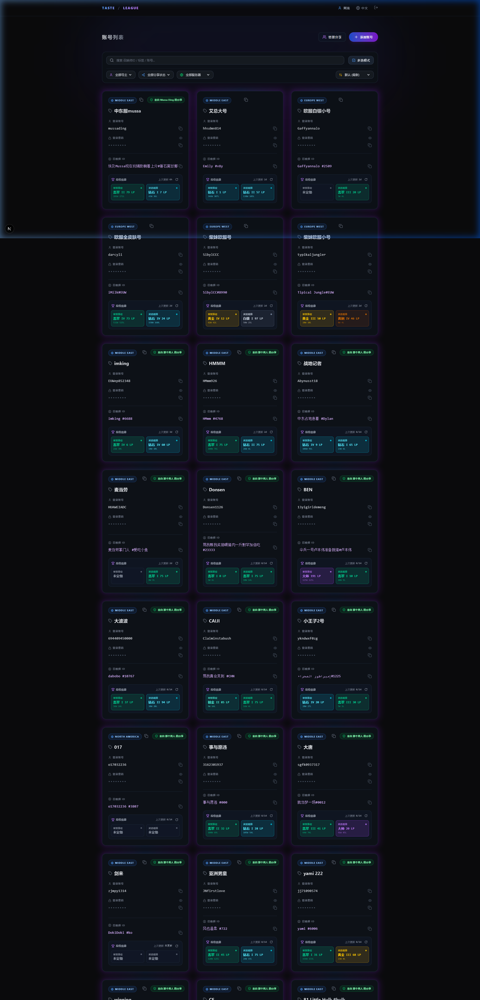
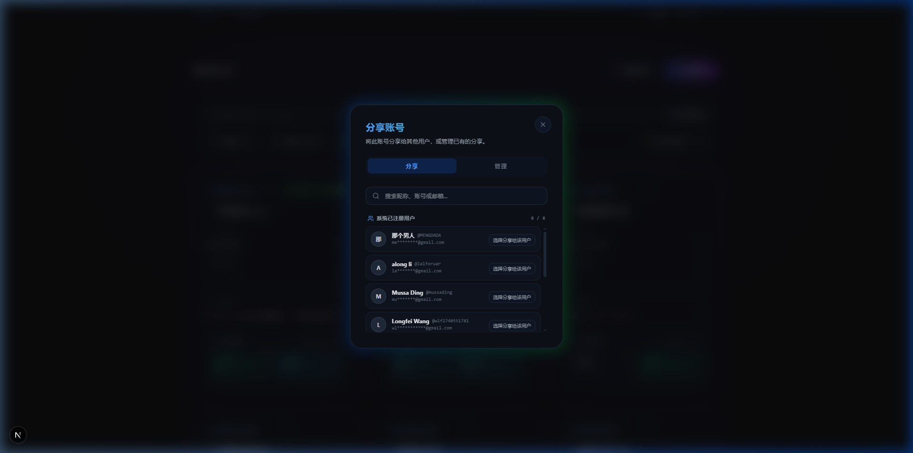
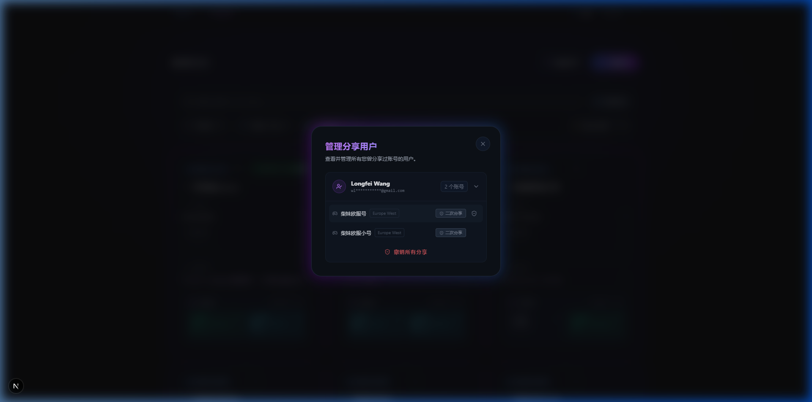

# 英雄联盟极简面板 (Taste League Dashboard)

[English](./README.en.md) | 简体中文

本面板是一个极简、优雅且具备强安全性（本地/私有化部署）的英雄联盟多账号管理与共享平台。它的设计严格恪守极致克制与高级感（"Taste"）的理念，专注于最纯粹的核心体验与细粒度的账号共享权限控制。

---

## 📸 界面预览 (Screenshots)

### 1. 多账号控制台 (Dashboard Preview)
*全局暗黑美学、磨砂玻璃卡片、实时段位胜率追踪、密码一键复制、多选批量操作条*



### 2. 账号分享与二次权限配置 (Share Modal & Quick Select)
*自动列出系统已注册用户、实时过滤检索、一键快速选择被分享人、二次分享权限授权开关*



### 3. 被分享人聚合管理面板 (Manage Shared Users)
*按被分享人智能聚合归类、多账号折叠列表、二次分享权限即时切换、单账号/一键全量撤销*



---

## ✨ 核心亮点

### 1. 🛡️ 细粒度多级分享与二次分享权限控制体系
- **单账号与批量多选分享**：支持在单账号卡片发起分享，或进入「多选模式」一键将多个账号批量分享给目标用户。
- **系统已注册用户快速检索与选择**：分享面板自动拉取服务器已注册用户列表，支持按昵称、用户名、邮箱实时过滤，一键快捷选中目标用户。
- **二次分享授权控制 (`can_reshare`)**：号主分享账号时可勾选「允许被分享人再次分享」。只有获得授权的用户才具备二次分享资格；未获得授权者不可分享。
- **多选智能权限过滤**：批量分享时，系统自动识别并排除无二次分享权限的账号，前后端双重拦截保障权限安全。
- **「管理分享」智能聚合面板**：管理面板自动按「被分享人」归纳合并名下所有已分享账号，号主可随时一键切换二次分享权限、单独撤销某账号或一键撤销全部。

### 2. 🌐 Google OAuth 2.0 一键登录与绑定
- **快捷登录与注册**：支持通过 Google 账号一键快捷登录与极速注册。
- **个人中心账号绑定**：在「个人设置」中支持绑定与解绑 Google 账号，支持密码登录与 Google 登录双轨并行。
- **全环境代理自适应**：后端回调自动识别访问 Origin，并支持本地开发通过 `HTTPS_PROXY` 代理换取 Token，海外 VPS 自动直连，无缝兼容两端。

### 3. 🎮 实时段位追踪与同步 (Riot Games API)
- **官方 API 深度对接**：根据召唤师 Riot ID 自动获取并展示单双排位与灵活组排最新段位勋章、胜点（LP）、胜率及胜负场次。
- **多维度即时刷新**：支持卡片级单账号一键即时刷新，并支持命令行脚本（`npm run rank:sync`）批量全量同步，数据自动持久化缓存至 Cloudflare D1 数据库。

### 4. 🔒 国防级数据落地保护 (AES-256-GCM)
- **原生双向加密**：采用 Node.js 原生 `crypto` 模块的 `AES-256-GCM` 算法对密码进行硬件级加解密。
- **零明文落地**：数据库中仅保存 `IV:Cipher:AuthTag` 组合密文，即使数据库文件意外泄露，无密钥状态下数据无法被逆向破解。

### 5. 🎨 极致克制的视觉语言与微交互
- **纯粹暗黑美学**：全局采用 `#0a0a0c` 与 `#0d1117` 深度暗黑背景，配合细腻的磨砂玻璃（Glassmorphism）与 Hextech 霓虹微光。
- **密码隐私与一键复制**：卡片密码默认严格遮罩为 `••••••••`，直接点击遮罩即可精准复制真实明文密码，附带平滑 Toast 提示。

### 6. 🌍 全链路国际化 (i18n)
- **多语言无缝切换**：原生集成 `next-intl`，支持中英文双语热切换。
- **Edge 边缘智能识别**：系统根据访客 IP（CN/TW/HK/MO）自动匹配并切换至中文模式。

---

## 🚀 部署与启动配置

### 1. 环境准备
克隆或下载项目后，复制环境示例文件，并按需修改 `.env` 环境变量文件中的凭证信息和端口：

```bash
cp .env.example .env
```

```env
# [极度危险⚠️] 32字节固定长度的加解密密钥 (务必为32个字符，如丢失会导致全部账号数据永久锁定)
ENCRYPTION_KEY="0123456789abcdef0123456789abcdef"

# JWT 签名安全密钥
JWT_SECRET="super-secret-jwt-key"

# 邮件 SMTP 配置 (用于注册时发送验证码)
SMTP_HOST="smtp.qq.com"
SMTP_PORT="465"
SMTP_SECURE="true"
SMTP_USER="your-email@qq.com"
SMTP_PASS="your-smtp-auth-code"
SMTP_FROM="admin@your-domain.com" # (可选) 自定义发件人邮箱，如果不填默认使用 SMTP_USER

# 运行端口配置
PORT="3021"

# Google OAuth 2.0 配置 (支持 Google 一键登录/绑定)
GOOGLE_CLIENT_ID="xxxxxxxx-xxxxxxxx.apps.googleusercontent.com"
GOOGLE_CLIENT_SECRET="GOCSPX-xxxxxxxxxxxxxxxxxxxxxxxx"

# 应用前端访问主地址 (本地填 http://localhost:3021，生产填部署主域名，无末尾斜杠)
NEXT_PUBLIC_APP_URL="https://league-dashboard.alonglfb.com"

# 本地调试 Google 登录代理 (仅在本地开发无法直连 Google API 时配置，生产海外服务器无需配置)
# HTTPS_PROXY="http://127.0.0.1:7890"

# Cloudflare D1 数据库配置 (HTTP API 通信凭证)
CLOUDFLARE_ACCOUNT_ID="your-cloudflare-account-id"
CLOUDFLARE_D1_DATABASE_ID="your-cloudflare-d1-database-id"
CLOUDFLARE_API_TOKEN="your-cloudflare-api-token"

# Riot Games 开发者 API Key (用于查询召唤师最新排位段位)
RIOT_API_KEY="RGAPI-xxxxxxxx-xxxx-xxxx-xxxx-xxxxxxxxxxxx"
```

---

### 2. 本地开发与启动

```bash
# 安装依赖
npm install

# 启动开发服务器
npm run dev

# (可选) 批量同步所有账号的最新段位数据至数据库
npm run rank:sync
```

---

### 3. Docker 容器化部署

本项目提供标准的 `compose.yaml`，支持容器化一键部署：

```bash
docker compose up -d --build
```

成功启动后，在浏览器访问 `http://localhost:3021`。

您将进入系统页面，首次使用可点击注册账户（通过邮箱验证码）或直接使用 Google 账号授权登录，登录后即可开始管理和分享您的账号。

---

### 4. GitHub Actions 自动化持续部署 (CI/CD)

项目已内置完整的 GitHub Actions 工作流（[`.github/workflows/deploy.yml`](.github/workflows/deploy.yml)），支持代码推送自动部署或手动点击部署。

#### 1) 配置 GitHub Secrets
进入仓库的 **Settings** -> **Secrets and variables** -> **Actions**，添加以下 Repository secrets：

| Secret 变量名 | 必填 | 描述 |
| :--- | :--- | :--- |
| `SERVER_HOST` | 是 | 目标服务器公网 IP 或域名 |
| `SERVER_USER` | 是 | SSH 连接用户名（如 `root`） |
| `SERVER_SSH_KEY` | 是 | 用于免密登录的 SSH 私钥 |
| `SERVER_PORT` | 否 | SSH 端口（默认 `22`） |
| `DOT_ENV` | 否 | **生产环境完整 `.env` 文件内容**（配置后会自动写入服务器并热更新；如未配置则保留服务器本地现存 `.env`） |

#### 2) 部署触发机制
- **自动触发**：向 `master` 分支执行 `git push` 时自动触发。
- **手动触发**：在 GitHub 仓库页面点击 **Actions** -> **Deploy to Server** -> **Run workflow** 即可一键手动部署。

---

## 📖 相关页面

项目包含了完整的开源、隐私以及使用协议说明：
- [关于项目](/about)
- [隐私政策](/privacy)
- [使用条款](/terms)
- [联系我们](/contact)

---
> 💡 本项目基于 [MIT 协议](LICENSE) 开源，欢迎在 [GitHub](https://github.com/alongLFB/league-dashboard) 提交 Issue 或参与共建！
